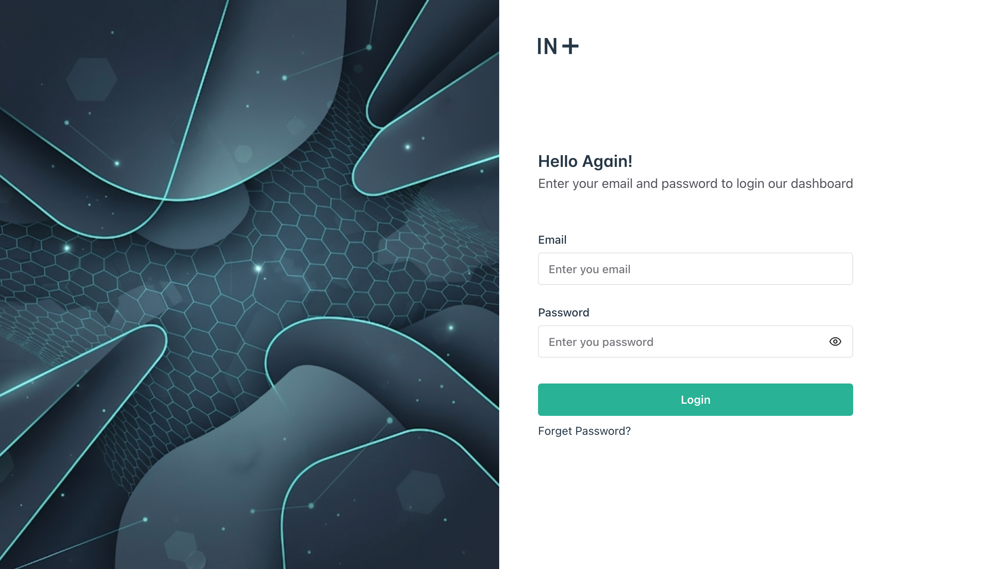
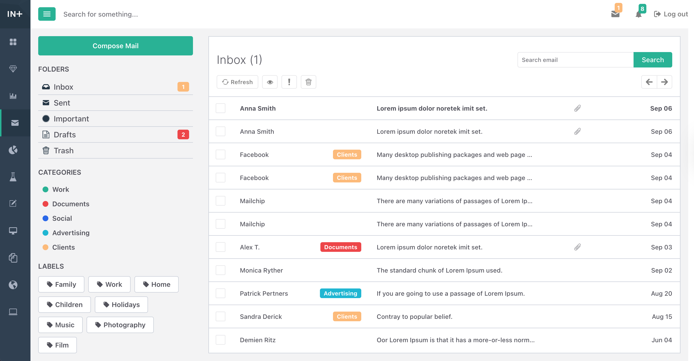

<a name="dashboard-mailbox-interface"></a>
# Dashboard Mailbox Interface

<a name="about"></a>

## About

**Mailbox Interface** is a key feature within the dashboard, designed to streamline internal communication. It allows users to receive emails directly in their inbox, compose and send messages to colleagues, view email content, delete messages, and mark emails as read. This feature integrates seamlessly with the dashboard, providing an intuitive and efficient way for users to manage their communications within the organization.





## Table of contents

- [Dashboard Mailbox Interface](#dashboard-mailbox-interface)
  - [About](#about)
  - [Table of contents](#table-of-contents)
  - [Features](#features)
  - [Getting Started](#getting-started)
  - [🎨 Dynamic Icon Library](#-dynamic-icon-library)
    - [How It Works](#how-it-works)
  - [Demo](#demo)
  - [Contributing](#contributing)
  - [License](#license)
  - [Show your support](#show-your-support)

<a name="features"></a>

## Features

* **Login**: A secure login page with a simple form for email and password. When the entered credentials match the mock data, the user is redirected to the Dashboard, where their inbox emails are displayed. All internal routes are protected and accessible only to authenticated users with valid credentials.

* **Mailbox**
The mailbox interface allows users to view their inbox and sent emails. Users can delete emails, mark unread emails as read, and interact with messages directly. The UI is built to support future extensions, including highlighting emails, sorting them into important folders, managing drafts, and adding categories or labels.

* **Compose Email**
Users can create and send new emails through the Compose feature. It can be accessed from the Compose Email button in the mailbox main page, which opens a modal for quick email drafting, or from the navigation menu under the mailbox feature, which provides a full dedicated page. Both options allow users to enter recipient details, subject, and message content before sending.

* **View Email**
Users can open and read individual emails in detail. The View Email page displays the email subject, sender and recipient information, and the full body of the message. From this view, users can also delete the email or mark it as read, ensuring better inbox management.

* **Email Management Actions**
The mailbox includes essential tools for managing emails efficiently. Users can delete emails, mark unread emails as read.

<a name="getting_started"></a>

## Getting Started

_This project will eventually be deployed on GitHub Pages for easy access without setup._ However, since the repository is currently private, you can run it locally by following these steps:

Clone the project
Download the project files to your local machine:

```bash 
git clone https://github.com/Maha-Magdy/dashboard-mailbox-interface.git
```

Install dependencies
Navigate into the project directory and install the required packages:

```bash
cd dashboard-mailbox-interface
npm install
```


Run the development server
Start the local development server:

```bash npm run dev ```


This will open the application in your browser, starting with the Login Page.

Login Credentials
You can log in with one of the following test users:

***Email: jane.smith@example.com, Password: password***

***Email: anna.smith@example.com, Password: password***

Once logged in, you’ll be redirected to the Dashboard Mailbox, where you can:

- View emails in the Inbox and Sent.

- Select, delete, and mark emails as read.

- Open and read individual messages.

- Compose and send emails.

- Send an email from Jane to Anna (or vice versa), then log in as the other user to see the message appear in their inbox.

<a name="dynamic-icon-library"></a>

## 🎨 Dynamic Icon Library

One of the most interesting and reusable features of this project is the **custom icon library** I built. It serves as a **single source of truth for all SVG icons** in the application, allowing consistent and dynamic usage throughout the dashboard. This library lets you **add, generate, and use icons freely** in a streamlined and scalable way.

### How It Works

1. **Add an Icon**  
   - Place the SVG path of the new icon in `icons/icons.ts` as a new object in the `icons` array.  
   - Make sure to include the **name** and **viewBox** of the icon.

2. **Generate or Watch Icons**  
   - Run the generator after every update:  
     ```bash
     npm run generate-icons
     ```  
   - Or keep the watcher running during development for automatic updates:  
     ```bash
     npm run watch-icons
     ```  

3. **Use Icons Across the App**  
   - Icons can be called as components dynamically anywhere in the application.  
   - Component names follow the pattern: `iconName + Icon` (e.g., `DashboardIcon`).

This approach ensures **consistency, scalability, and reusability** for all icon needs in the project, making the UI cohesive and easy to maintain.

<a name="demo"></a>

## Demo

Here is the link to the video demo of the Dashboard Mailbox Interface:

- [Video Demo Link](https://www.loom.com/share/d74580279451417a932bd84df1d0ab49?sid=922fa814-33cc-41a3-8a14-7cc13d37f087)


<a name="contributing"></a>

## Contributing

Contributions, issues, and feature requests are welcome!

Feel free to check the [issues page](https://github.com/Maha-Magdy/dashboard-mailbox-interface/issues).

<a name="license"></a>

## License

This project is [MIT](./LICENSE) licensed.

## Show your support

Give a ⭐️ if you like this project!
